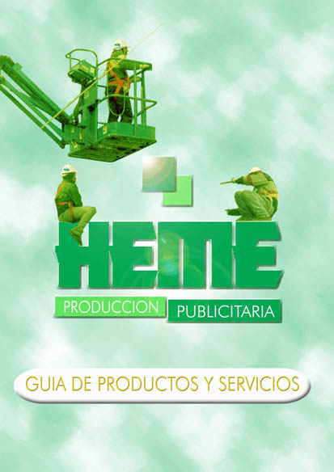

# Case 4

Lorem Ipsum er ganske enkelt fyldtekst fra print- og typografiindustrien. Lorem Ipsum har været standard fyldtekst siden 1500-tallet, hvor en ukendt trykker sammensatte en tilfældig spalte for **at trykke en bog** til sammenligning af forskellige skrifttyper. Lorem Ipsum har ikke alene overlevet fem århundreder, men har også vundet indpas i elektronisk typografi uden væsentlige ændringer. 

Du kan se her:
[Tutorial ](https://code.tutsplus.com/es/tutorials/make-creating-websites-fun-again-with-hugo-the-static-website-generator-written-in-go--cms-27319)

# *mere*
Lorem Ipsum er ganske enkelt fyldtekst fra print- og typografiindustrien. Lorem Ipsum har været standard fyldtekst siden 1500-tallet, hvor en ukendt trykker sammensatte en tilfældig spalte for at trykke en bog til sammenligning af forskellige skrifttyper. Lorem Ipsum har ikke alene overlevet fem århundreder, men har også vundet indpas i elektronisk typografi uden væsentlige **ændringer**.

## *mere og mere*

Lorem Ipsum er ganske enkelt fyldtekst fra print- og typografiindustrien. Lorem Ipsum har været standard fyldtekst siden 1500-tallet, hvor en ukendt trykker sammensatte en tilfældig spalte for at trykke en bog til sammenligning af forskellige skrifttyper. Lorem Ipsum har ikke alene overlevet fem århundreder, men har også vundet indpas i elektronisk typografi uden væsentlige ændringer.

 
 * alene overlevet fem
 * alene overlevet fem
 * alene overlevet fem
 
 
 Lorem Ipsum er ganske enkelt fyldtekst fra print- og typografiindustrien. Lorem Ipsum har været standard fyldtekst siden 1500-tallet, hvor en ukendt trykker sammensatte en tilfældig spalte for at trykke en bog til sammenligning af forskellige skrifttyper. 
 
 1. Fyldtekst siden 1500-tallet
 2. Fyldtekst siden 1500-tallet
 3. Fyldtekst siden 1500-tallet
 

